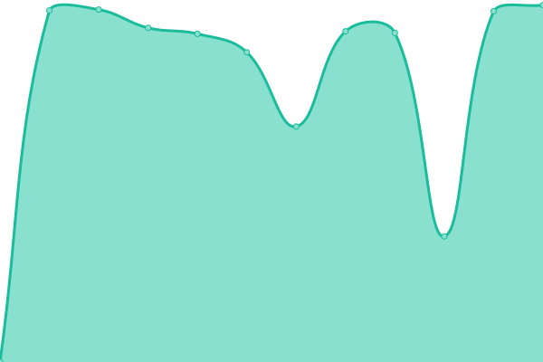

# [📈 Live Status](https://daotrunghieu.github.io/upptime): <!--live status--> **🟩 All systems operational**

This repository contains the open-source uptime monitor and status page for [Hiếu](https://daotrunghieu.github.io/upptime), powered by [Upptime](https://github.com/upptime/upptime).

With [Upptime](https://upptime.js.org), you can get your own unlimited and free uptime monitor and status page, powered entirely by a GitHub repository. We use [Issues](https://github.com/daotrunghieu/upptime/issues) as incident reports, [Actions](https://github.com/daotrunghieu/upptime/actions) as uptime monitors, and [Pages](https://daotrunghieu.github.io/upptime) for the status page.

<!--start: status pages-->
<!-- This summary is generated by Upptime (https://github.com/upptime/upptime) -->
<!-- Do not edit this manually, your changes will be overwritten -->
<!-- prettier-ignore -->
| URL | Status | History | Response Time | Uptime |
| --- | ------ | ------- | ------------- | ------ |
|  HOME | 🟩 Up | [home.yml](https://github.com/daotrunghieu/upptime/commits/HEAD/history/home.yml) | 

 648ms
     
 | 

<a href="https://status.daotrunghieu.com/history/home">100.00%</a>
    

|  grafana | 🟩 Up | [grafana.yml](https://github.com/daotrunghieu/upptime/commits/HEAD/history/grafana.yml) | 

 187ms
     
 | 

<a href="https://status.daotrunghieu.com/history/grafana">100.00%</a>
    

|  [kibana](kibana.daotrunghieu.com) | 🟩 Up | [kibana.yml](https://github.com/daotrunghieu/upptime/commits/HEAD/history/kibana.yml) | 

 1790ms
     
 | 

<a href="https://status.daotrunghieu.com/history/kibana">99.75%</a>
    

|  [jenkins](ci.daotrunghieu.com) | 🟩 Up | [jenkins.yml](https://github.com/daotrunghieu/upptime/commits/HEAD/history/jenkins.yml) | 

 1611ms
     
 | 

<a href="https://status.daotrunghieu.com/history/jenkins">100.00%</a>
    

|  [wiki](wiki.daotrunghieu.com) | 🟩 Up | [wiki.yml](https://github.com/daotrunghieu/upptime/commits/HEAD/history/wiki.yml) | 

 1077ms
     
 | 

<a href="https://status.daotrunghieu.com/history/wiki">100.00%</a>
    

|  [blog](blog.daotrunghieu.com) | 🟩 Up | [blog.yml](https://github.com/daotrunghieu/upptime/commits/HEAD/history/blog.yml) | 

 1076ms
     
 | 

<a href="https://status.daotrunghieu.com/history/blog">100.00%</a>
    

<!--end: status pages-->

[**Visit our status website →**](https://daotrunghieu.github.io/upptime)

## 📄 License

- Powered by: [Upptime](https://github.com/upptime/upptime)
- Code: [MIT](./LICENSE) © [Hiếu](https://daotrunghieu.github.io/upptime)
- Data in the `./history` directory: [Open Database License](https://opendatacommons.org/licenses/odbl/1-0/)
